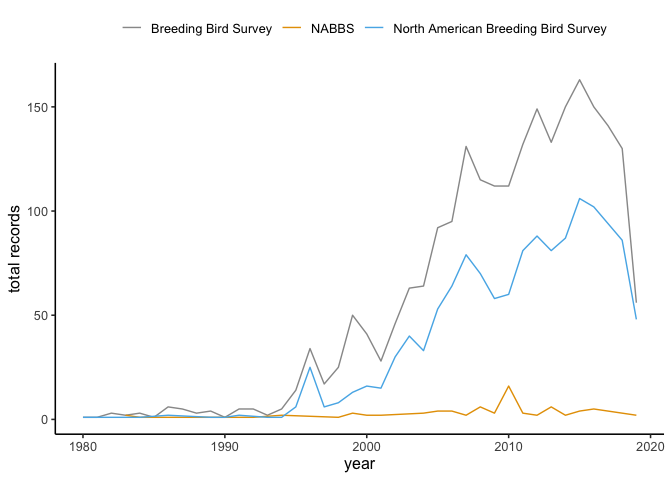
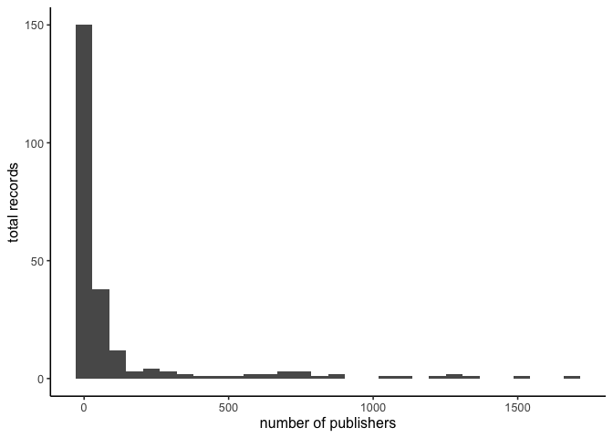
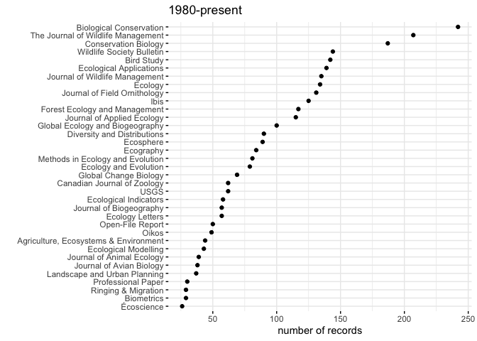

Using GeoDeepDive (xDD) to Track North American Breeding Bird Survey
Citations
================
Last updated: 2019-12-13

## About

This project seeks to identify publications within which the [USGS North
American Breeding Bird Survey](https://www.pwrc.usgs.gov/bbs/) has been
referenced or mentioned. This project uses pre-extracted information
available via API from the [GeoDeepDive](https://geodeepdive.org)
infrastructure.

## Overview of BBS in records available in the GeoDeepDive database.

We can use various search terms to identify potential uses of the
[NABBS](https://www.pwrc.usgs.gov/bbs/) data or results in the
literature. For example, here we found 2487 unique publications which
used any of the following phrases
exactly:

| Exacts earch phrase                   | Number of unique records in xDD/GDD |
| ------------------------------------- | ----------------------------------- |
| “North American Breeding Bird Survey” | 0                                   |
| “Breeding Bird Survey”                | 0                                   |
| “NABBS”                               | 0                                   |

<!-- -->

When we remove the redundancies in the records returned using the
abovementioned searches,2509 remain.

We can visualize the distribution of records among unique publishers.
Few publications contain the bulk of the records.
<!-- -->

Viewing the publications with at least 25 unique records:
<!-- -->

## This project relies on the UW Deepdive Infrastructure

[Original branch from which this repository was
forked](UW-Deepdive-Infrastructure/app-template). Check out [the
wiki](https://github.com/UW-Deepdive-Infrastructure/app-template/wiki)
for more information on getting started.

## USGS Provisional Software

This software is preliminary or provisional and is subject to revision.
It is being provided to meet the need for timely best science. The
software has not received final approval by the U.S. Geological Survey
(USGS). No warranty, expressed or implied, is made by the USGS or the
U.S. Government as to the functionality of the software and related
material nor shall the fact of release constitute any such warranty. The
software is provided on the condition that neither the USGS nor the U.S.
Government shall be held liable for any damages resulting from the
authorized or unauthorized use of the software.
